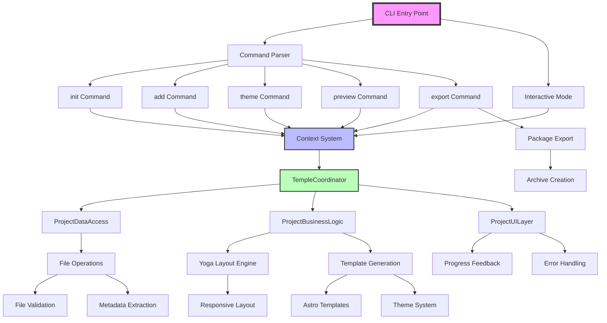

# SUBMITIT CLI - Project Planning Session

## Current State Analysis

### What We Have Working
- ✅ **Core CLI Structure** - Command pattern with init, add, preview, export, theme commands
- ✅ **Yoga Layout Engine** - Facebook's actual flexbox layout engine properly integrated
- ✅ **Abstract Architecture** - Clean separation with DataAccess, BusinessLogic, UILayer
- ✅ **Context System** - Dependency injection with TempleCoordinator pattern
- ✅ **Package Dependencies** - Core packages installed (yoga-layout, ink, chalk, astro, etc.)

### What Needs Work - Broad Categories

#### 1. **CORE FUNCTIONALITY GAPS**
- Missing concrete implementations of abstract classes
- CLI commands exist but may not be fully functional
- File operations and validation systems incomplete

#### 2. **INTEGRATION ISSUES**
- Abstract layers not properly connected to CLI commands
- Template generation and preview systems disconnected
- Package export functionality unclear

#### 3. **POLISH & USER EXPERIENCE**
- Terminal UI components not implemented
- Progress feedback and animations missing
- Error handling and graceful degradation needed

#### 4. **OPTIMIZATION CONCERNS**
- Memory management for layout calculations
- Performance profiling and caching
- Dependency loading optimization

#### 5. **NAMING & CLARITY ISSUES**
- Potential ninja-themed confusion vs actual build system
- Ceremonial/emotional language that may be distracting
- Architecture metaphors that need review

---

## Planning Process

**New Approach**: 
1. Create a System Hierarchy Diagram
2. Create a Mermaid chart for visualization
3. Write complete pseudo-code as if app were single monolithic JS file
4. Use that understanding to create focused action plan

### Step 1: System Hierarchy Diagram

```
SUBMITIT CLI
├── CLI Layer (Entry Point)
│   ├── Command Parser (commander.js)
│   ├── Commands
│   │   ├── init (create new project)
│   │   ├── add (add content to project)
│   │   ├── theme (set visual theme)
│   │   ├── preview (view project)
│   │   └── export (package deliverable)
│   └── Interactive Mode (Ink app)
│
├── Core Context System
│   ├── Dependency Injection Container
│   ├── Service Registry
│   ├── Configuration Management
│   └── Logger/Analytics
│
├── Abstract Architecture Layers
│   ├── DataAccess Layer (file system operations)
│   ├── BusinessLogic Layer (transformation logic)
│   ├── UILayer (terminal interface)
│   └── TempleCoordinator (binds layers together)
│
├── Concrete Implementations
│   ├── ProjectDataAccess (extends DataAccess)
│   ├── ProjectBusinessLogic (extends BusinessLogic)
│   └── ProjectUILayer (extends UILayer)
│
├── Core Systems
│   ├── Yoga Layout Engine (Facebook's flexbox)
│   ├── File Operations (validation, metadata, streaming)
│   ├── Template Generation (Astro integration)
│   └── Package Export (archiving, delivery)
│
└── Support Systems
    ├── Error Handling
    ├── Progress Feedback
    ├── Theme System
    └── Performance Monitoring
```

### Step 2: Mermaid Chart Code



### Step 3: Monolithic Pseudo-Code

```javascript
// SUBMITIT CLI - Complete Application Flow
class SubmitItMonolith {
  constructor() {
    this.projects = new Map();
    this.currentProject = null;
    this.themes = ['default', 'noir', 'academic', 'brutalist', 'modern'];
    this.yogaLayoutEngine = new YogaLayoutEngine();
  }

  // === MAIN CLI ENTRY POINT ===
  async main(args) {
    const [command, ...params] = args;
    
    switch(command) {
      case 'init':
        return await this.initProject(params[0], params[1]);
      case 'add':
        return await this.addContent(params);
      case 'theme':
        return await this.setTheme(params[0]);
      case 'preview':
        return await this.preview(params[0]);
      case 'export':
        return await this.exportProject(params[0]);
      default:
        return await this.interactiveMode();
    }
  }

  // === CORE COMMANDS ===
  async initProject(name, theme = 'default') {
    // 1. Create project structure
    this.currentProject = {
      name,
      theme,
      content: [],
      metadata: { created: Date.now() },
      config: this.getDefaultConfig()
    };
    
    // 2. Create file system structure
    await this.createProjectDirectory(name);
    await this.writeConfigFile(this.currentProject);
    
    // 3. Initialize layout engine
    await this.yogaLayoutEngine.initialize();
    
    return `Project ${name} initialized with ${theme} theme`;
  }

  async addContent(files) {
    // 1. Validate files
    const validatedFiles = await this.validateFiles(files);
    
    // 2. Extract metadata
    const contentItems = await this.extractMetadata(validatedFiles);
    
    // 3. Add to project
    this.currentProject.content.push(...contentItems);
    
    // 4. Update layout calculations
    await this.recalculateLayout();
    
    return `Added ${files.length} items to project`;
  }

  async setTheme(theme) {
    if (!this.themes.includes(theme)) {
      throw new Error(`Unknown theme: ${theme}`);
    }
    
    this.currentProject.theme = theme;
    await this.regenerateTemplates();
    
    return `Theme changed to ${theme}`;
  }

  async preview(mode = 'web') {
    // 1. Generate layout
    const layout = await this.yogaLayoutEngine.generateLayout(
      this.currentProject.content,
      { theme: this.currentProject.theme }
    );
    
    // 2. Generate templates
    const templates = await this.generateAstroTemplates(layout);
    
    // 3. Start preview server
    if (mode === 'web') {
      return await this.startWebPreview(templates);
    } else {
      return await this.showTerminalPreview(layout);
    }
  }

  async exportProject(outputPath) {
    // 1. Generate final layout
    const layout = await this.yogaLayoutEngine.generateLayout(
      this.currentProject.content,
      { theme: this.currentProject.theme, production: true }
    );
    
    // 2. Generate all templates
    const templates = await this.generateAstroTemplates(layout);
    
    // 3. Build static site
    const builtSite = await this.buildStaticSite(templates);
    
    // 4. Create archive
    const archive = await this.createArchive(builtSite, outputPath);
    
    return `Project exported to ${archive}`;
  }

  // === CORE SYSTEMS ===
  async validateFiles(files) {
    // Check file types, sizes, security
    // Return validated file objects with metadata
  }

  async extractMetadata(files) {
    // Extract EXIF, document properties, etc.
    // Return content items with rich metadata
  }

  async recalculateLayout() {
    // Use Yoga layout engine to calculate optimal arrangement
    // Cache results for performance
  }

  async generateAstroTemplates(layout) {
    // Generate Astro components based on layout and theme
    // Return template files
  }

  async startWebPreview(templates) {
    // Start Astro dev server
    // Return preview URL
  }

  async showTerminalPreview(layout) {
    // Render layout in terminal using Ink
    // Show interactive preview
  }

  async buildStaticSite(templates) {
    // Run Astro build process
    // Return built site files
  }

  async createArchive(files, outputPath) {
    // Create zip/tar archive
    // Return archive path
  }
}

// === USAGE ===
const app = new SubmitItMonolith();
await app.main(process.argv.slice(2));
```

### Notes During Planning
- The hierarchy shows we have most pieces but they're not connected
- Mermaid chart visualizes the flow clearly
- Pseudo-code reveals the actual business logic we need to implement
- Key insight: We need to focus on making the core command flow work first

---

## NEW VISION: GUI-First Interactive Workspace

### Core Concept: "Work Plates" + "Post Cards"

**Work Plates** (Facebook Yoga shines here):
- Click terminal background → opens interactive work frame/window
- Users can drag & drop files into these frames
- Files "stick" in the work area
- Visual arrangement using Yoga layout engine
- Multiple work plates can be open simultaneously

**Post Card Output**:
- Final deliverable is like a beautiful postcard/presentation
- Clean, polished, intentional-looking result
- Skip themes for now - focus on one good default look

### Core Features (GUI-First)

#### 1. **Interactive Workspace**
- Terminal becomes clickable canvas
- Work frames/plates open on demand
- Drag & drop file management
- Visual arrangement and organization

#### 2. **Flexible Packaging**
- Any format: zip, rar, iso, bins, repos, whatever
- File structure options: lastname_ suffix, sequential naming, etc.
- Custom package icons
- User-defined naming conventions

#### 3. **Smart File Handling** (Ninja integration)
- Fast processing of large file structures
- Intelligent file type detection
- Metadata preservation
- Streaming for big files

#### 4. **Post Card Generation**
- Beautiful final presentation
- Professional, intentional appearance
- Ready-to-submit deliverable
- Multiple output formats

### Technical Implementation

**Yoga Layout Engine**: Powers the work plates and visual arrangement
**Ninja File Operations**: Handles large file structures efficiently
**Ink Interactive UI**: Provides the clickable terminal interface
**Astro Post Card Generation**: Creates the final beautiful output

### User Flow
1. User opens submitit
2. Clicks terminal background → work plate opens
3. Drags files into work plate
4. Arranges visually (Yoga handles layout)
5. Exports as post card deliverable
6. Chooses format (zip, rar, etc.) and naming convention

This is way cooler than just CLI commands!
